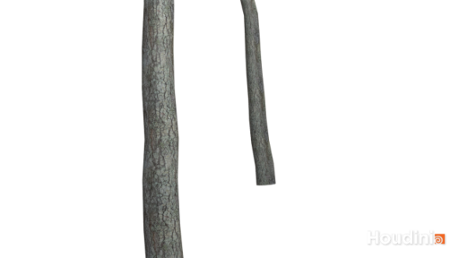
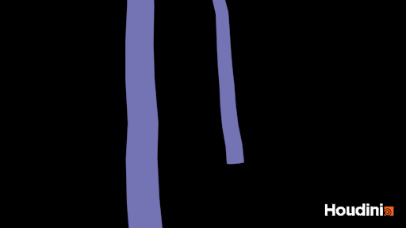
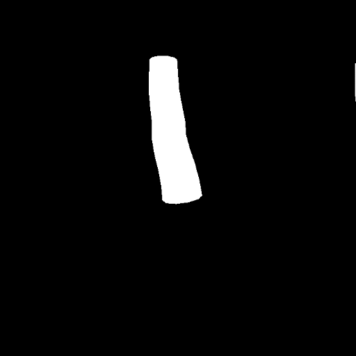
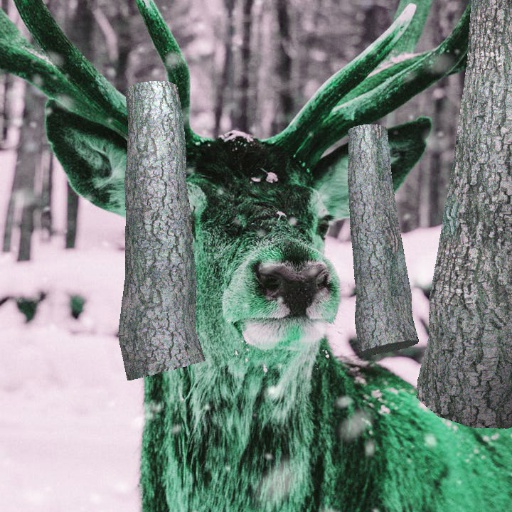
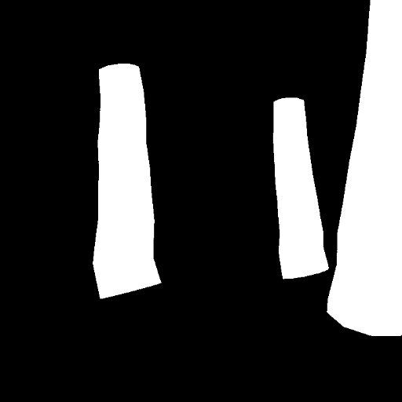
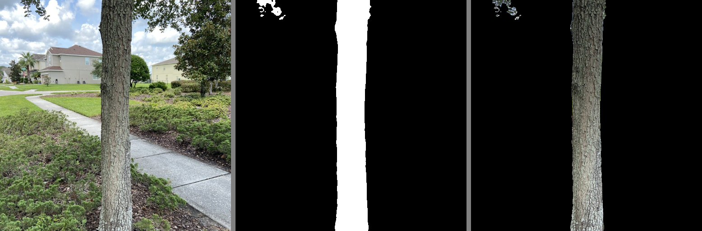

# DeepLabV3 for Tree Segmentation for IOS

The goal of this repo is to generate tree trunks using Houdini procedural modeling and rendered using textures captured from a cell phone. This data is needed for data segmentation task for another App I am working on. The data folder contains all the files you need to get started.

<br/><br/>

**Note: Model currently requires tensorflow 2.6+ to work.**

## Folder Structure
**/data/background**: random backgrounds JPGs found on the internet as well as some images I have captured without trees in the scene  
**/data/foreground**: generated houdini data with transparent backgrounds. Format: PNG 1280 by 720 pixels  
**/data/rendered_mask**: generated masks  corresponding to the foregrounds. Format: PNG 1280 by 720 pixels  
**/data/test**: captured images of tree trunks that will test model strength

 foreground            |   rendered_mask
:-------------------------:|:-------------------------:
  |  
  


  
**Note:** _I am using Houdini Apprentice which is the free version and it contains a watermark in the lower right corner. Since deeplabv3 takes square images, this is not a problem since I am left cropping the image to produce a 720 by 720 image without the watermark._


<br/><br/>


## How To
## prep_renders.py
Running prep renders will merge background and foreground images to create the **data/image** folder. It will also use the images in **data/rendered_mask** and transform them into a grayscale image with a background of 0 and a tree classification with value 255 in **data/mask**.
```
$ python prep_renders.py

```

 image            |   mask
:-------------------------:|:-------------------------:
  |  


<br/><br/>

## data.py
Run this file afterwards to augment the data, 5 augmented images will be created for each file in the **data/image** folder and will be placed in a new folder called **data_augmented/train/image** and **data_augmented/test/image**. The same will happen to the masks. The images in this step will be resized to 512 by 512 which is the input for the neural network.
```
$ python data.py
```

 image            |   mask
:-------------------------:|:-------------------------:
  |  


<br/><br/>


## train.py
Finally, you can train the model using the train.py file or you can alternatively run the treeseg_train.ipynb in Google Collaboratory to have access to their Free TPUs for a faster training time.
```
$ python train.py
```

<br/><br/>


# Real World Results
Training on synthetic data has mixed results in the real world, however it can help you jumpstart a dataset with real world data.  



<br/><br/>

# iOS Implementation
_treeseg_coreml.ipynb_ file will allow you to convert the model into a CoreML model for iPhone/iPad.  If you need a sample project to test out the model, check out my other repo: https://github.com/isakdiaz/mobilenetv2-ios-app

<br/><br/>

## If you want to see more results, check out the [colab notebook.](treeseg_train.ipynb)
